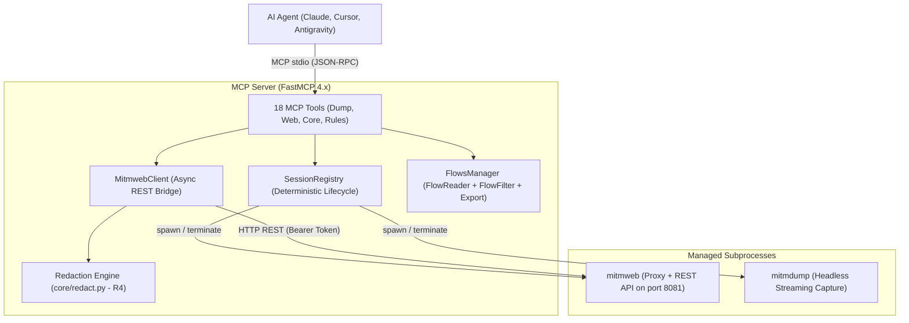

# mcp-security-mitmproxy

MCP (Model Context Protocol) server exposing the [mitmproxy](https://mitmproxy.org) ecosystem (`mitmdump`, `mitmweb`, and `mitmproxy`) to AI agents.

Designed to allow LLMs and autonomous agents to intercept, inspect, modify, and replay HTTP, WebSocket, TCP, and UDP traffic under controlled security constraints and process isolation.

---

## 🏗️ Architecture

The server uses a hybrid architecture: it runs `mitmweb` or `mitmdump` inside managed subprocesses with deterministic teardown (`app_lifespan`), while flow observation happens over an authenticated asynchronous REST bridge (`MitmwebClient`). Offline analysis and export of saved dumps execute in-process without allocating network ports.



---

## ⚡ Prerequisites and Installation

The project requires **Python 3.13+** and uses [uv](https://docs.astral.sh/uv/) for package and virtual environment management.

```bash
# Clone repository
git clone https://github.com/dandgabr/mcp-security-mitmproxy.git
cd mcp-security-mitmproxy

# Sync virtual environment and dependencies
uv sync

# Activate virtual environment (optional when using 'uv run')
source .venv/bin/activate
```

---

## 🚀 Usage

### 1. Starting the MCP Server via stdio

Run the server as a child process for MCP clients (Claude Desktop, Cursor, Zed, Antigravity):

```bash
uv run mcp-security-mitmproxy
```

Or via Python module:

```bash
uv run python -m mcp_security_mitmproxy
```

### 2. MCP Client Configuration

#### Claude Desktop (`claude_desktop_config.json`)

```json
{
  "mcpServers": {
    "mitmproxy": {
      "command": "uv",
      "args": [
        "--directory",
        "/absolute/path/to/mcp-security-mitmproxy",
        "run",
        "mcp-security-mitmproxy"
      ],
      "env": {
        "MCP_MITM_WEB_HOST": "127.0.0.1",
        "MCP_MITM_WEB_PORT": "8081"
      }
    }
  }
}
```

#### Cursor (`.cursor/mcp.json`)

```json
{
  "mcpServers": {
    "mitmproxy": {
      "command": "uv",
      "args": [
        "--directory",
        "/absolute/path/to/mcp-security-mitmproxy",
        "run",
        "mcp-security-mitmproxy"
      ]
    }
  }
}
```

#### Zed (`~/.config/zed/settings.json`)

```json
{
  "context_servers": {
    "mitmproxy": {
      "command": {
        "path": "uv",
        "args": [
          "--directory",
          "/absolute/path/to/mcp-security-mitmproxy",
          "run",
          "mcp-security-mitmproxy"
        ]
      }
    }
  }
}
```

---

## ⚙️ Environment Variables and Settings

Runtime configuration is handled in [`config.py`](file:///home/daniel/Code/mcp-security-mitmproxy/src/mcp_security_mitmproxy/config.py):

| Variable | Default | Description |
| :--- | :--- | :--- |
| `MCP_MITM_WEB_HOST` | `127.0.0.1` | Bind address for mitmweb REST/Web UI interface (R1). |
| `MCP_MITM_WEB_PORT` | `8081` | HTTP port for web interface and REST bridge. |

---

## 🛠️ Catalog of 18 MCP Tools

The tools are grouped into four operational categories:

### 1. `mitmdump` Controls (Headless & Capture)

* **`mitmdump_start`**: Starts a headless traffic capture session with one or more proxy modes (regular, reverse, upstream, etc.), optional `.mitm` dump saving, and Python addon scripts.
* **`mitmdump_stop`**: Deterministically terminates an active proxy session and releases allocated ports.
* **`mitmdump_replay`**: Replays captured flows from dump files using client replay (`-C`) or server replay (`-S`).

### 2. `mitmweb` Controls (Interactive Inspection & REST)

* **`mitmweb_start`**: Starts a proxy session with web UI and REST API enabled. Generates a local cryptographic authentication token.
* **`mitmweb_stop`**: Stops the mitmweb session, closing both proxy and REST endpoints.
* **`mitmweb_get_flows`**: Returns a paginated list of captured flows (`FlowSummary`) with method, host, path, HTTP status, and duration.
* **`mitmweb_get_flow_detail`**: Retrieves full flow details (headers, payloads, and WebSocket messages) with automatic secret redaction enabled by default (R4).

### 3. Core Commands and Offline Operations (`core`)

* **`session_list`**: Lists all registered sessions (running, stopped, or failed).
* **`session_status`**: Returns operational runtime details for a session by UUID.
* **`mitm_execute_command`**: Runs allowlisted mitmproxy commands on active sessions (such as `view.clear`, `flow.kill`, `flow.resume`). Commands outside the allowlist are denied (R3).
* **`mitm_export_flow`**: Exports a flow to `curl`, `httpie`, or `raw` formats, either from an active session dump or directly from a `.mitm` file.
* **`mitm_filter_flows`**: Evaluates FlowFilter syntax expressions (`~u /api/`, `~m POST`, `~c 200`, `~b json`) over offline dumps or live sessions.

### 4. Codeless Traffic Manipulation & Rules (`rules` — Phase 4)

* **`mitm_set_map_remote`**: Redirects requests matching a URL regex pattern to a remote destination.
* **`mitm_set_map_local`**: Serves mocked responses from allowlisted local files, guarded against Local File Inclusion (LFI - R3) via `allowed_mock_roots`.
* **`mitm_modify_headers`**: Injects, alters, or removes HTTP headers on requests and responses, enforced with RFC 9110 token validation and rejection of unsafe `@file` syntax.
* **`mitm_modify_body`**: Replaces request or response payload fragments using regex patterns (DOTALL) without disk access.
* **`mitm_list_rules`**: Lists active traffic mutation rules organized by family with match counters.
* **`mitm_clear_rules`**: Clears active rules for a specific family or resets all mutation families atomically.

---

## 🔒 Security Model and Safeguards

The server enforces strict controls against unauthorized access and credential leakage:

1. **R1 — Restricted Network Binding**: Default `web_host` is `127.0.0.1`. Non-loopback bindings (`0.0.0.0`) require explicit parameters and trigger audit warnings.
2. **R2 — Key Isolation and Session Protection**: Web tokens are generated using `secrets.token_hex(16)` and stored in `config.yaml` (`0600` permissions) inside per-session isolated directories (`0700` permissions), avoiding exposure in `/proc/<pid>/cmdline`.
3. **R3 — Strict Allowlist for Paths and Commands**: Paths for `.mitm` dumps, addon scripts, and mocks pass through `ensure_allowed()`, resolving symlinks and blocking directory traversal (`PATH_NOT_ALLOWED`). In-process command execution is restricted to `ALLOWED_COMMANDS` (`COMMAND_NOT_ALLOWED`). Raw option overrides through `--set` block reserved options (`confdir`, `scripts`, `map_local`, etc.).
4. **R4 — Automatic Secret Redaction**: Inspection tools sanitize authentication headers (`Authorization`, `Cookie`, `X-API-Key`) and apply regex matching across text bodies to mask tokens and passwords (`[REDACTED]`) by default.
5. **R5 — No Implicit Privilege Escalation**: Modes requiring elevated kernel permissions (such as eBPF `local` mode or `tun`) fail explicitly with configuration instructions rather than attempting automatic privilege escalation.

---

## 🧪 Testing, Quality, and Packaging

Code integrity is verified through unit, adversarial, and live integration tests:

```bash
# Run test suite
uv run pytest

# Run tests with coverage report
uv run pytest --cov=mcp_security_mitmproxy

# Run type and lint checks
uv run ruff check

# Verify code formatting
uv run ruff format --check

# Build distributable artifacts (wheel and sdist)
uv build
```

---

## 📚 Technical Documentation

### User Guide (`docs/user-guide/`)

* [Getting Started](docs/user-guide/01-getting-started.md) — install, launch, first capture session.
* [Tools Reference](docs/user-guide/02-tools-reference.md) — all 18 MCP tools: inputs, outputs, errors, examples.
* [Configuration](docs/user-guide/03-configuration.md) — environment variables, settings, filesystem allowlists.
* [Security Model](docs/user-guide/04-security-model.md) — R1–R5 enforcement, reserved options, error handling.
* [Secrets Handling](docs/user-guide/05-secrets-handling.md) — redaction engine, token lifecycle, on-disk artifacts.

### Architecture and ADRs

* [ADR-001: Technology Stack and Subprocess Execution Architecture](docs/adr/0001-stack-tecnologico-e-arquitetura-de-execucao.md)
* [ADR-002: Secret Redaction Strategy and In-Process Flow Management](docs/adr/0002-redacao-de-segredos-e-gestao-de-fluxos-offline.md)
* [ADR-003: Codeless Traffic Manipulation, Dynamic Rules, and LFI Prevention](docs/adr/0003-manipulacao-trafego-regras-addons.md)
* [ADR-004: Integrated Validation, Security Compliance (R1–R5), E2E Live Testing, and Packaging](docs/adr/0004-validacao-integrada-e-entrega-final.md)
* [Architecture and MCP Contracts Overview](docs/architecture/0001-arquitetura-e-contratos-mcp.md)
* [Technical Specification: Phase 3 (MCP Tools, REST Client, and Redaction)](docs/architecture/0002-fase-3-ferramentas-mcp-webclient-redaction.md)
* [Technical Specification: Phase 4 (Codeless Traffic Rules and Addons)](docs/architecture/0003-fase-4-regras-addons.md)

---

## 📄 License

This project is licensed under the terms of the [MIT License](LICENSE).