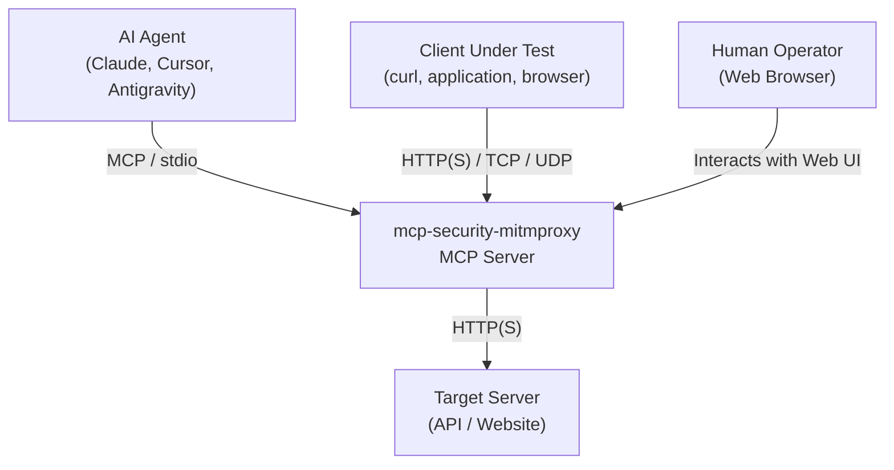
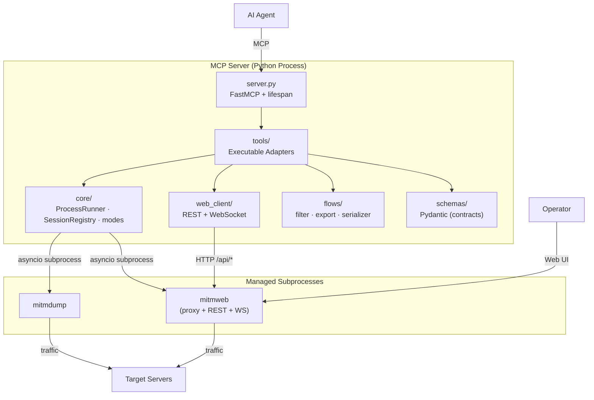

# Architecture and MCP Contracts — mcp-security-mitmproxy

> **Phase 1 · Architecture Document (Validated across Phases 1, 2, 3, 4, and 5)**
> Companion ADRs: [ADR-001](../adr/0001-stack-tecnologico-e-arquitetura-de-execucao.md), [ADR-002](../adr/0002-redacao-de-segredos-e-gestao-de-fluxos-offline.md), [ADR-003](../adr/0003-manipulacao-trafego-regras-addons.md), and [ADR-004](../adr/0004-validacao-integrada-e-entrega-final.md).
> See also Phase specifications: [Phase 3 Specification](./0002-fase-3-ferramentas-mcp-webclient-redaction.md) and [Phase 4 Specification](./0003-fase-4-regras-addons.md).

---

## 1. C4 View

### 1.1 Level 1 — Context



### 1.2 Level 2 — Containers



### 1.3 Module Dependency Invariant (Build Invariant)

```
tools ──► core, web_client, flows, schemas
web_client ──► schemas
flows ──► schemas
core ──► schemas
schemas ──► (pydantic only — zero mitmproxy imports)
```

`schemas/` contains pure contracts: no I/O, no `mitmproxy`, no `asyncio`. This isolation allows static JSON Schema validation without launching the proxy runtime.

---

## 2. Directory Structure

```
mcp-security-mitmproxy/
├── pyproject.toml                 # hatchling; requires-python = ">=3.13"
├── README.md
├── LICENSE
├── docs/
│   ├── adr/
│   │   ├── 0001-stack-tecnologico-e-arquitetura-de-execucao.md
│   │   ├── 0002-redacao-de-segredos-e-gestao-de-fluxos-offline.md
│   │   ├── 0003-manipulacao-trafego-regras-addons.md
│   │   └── 0004-validacao-integrada-e-entrega-final.md
│   └── architecture/
│       ├── 0001-arquitetura-e-contratos-mcp.md
│       ├── 0002-fase-3-ferramentas-mcp-webclient-redaction.md
│       └── 0003-fase-4-regras-addons.md
├── src/
│   └── mcp_security_mitmproxy/
│       ├── __init__.py            # __version__
│       ├── __main__.py            # python -m mcp_security_mitmproxy
│       ├── server.py              # FastMCP, lifespan, registration
│       ├── config.py              # Settings (pydantic-settings)
│       │
│       ├── core/
│       │   ├── __init__.py
│       │   ├── process.py         # ProcessRunner: spawn, watch, terminate
│       │   ├── session.py         # SessionRegistry: UUID -> SessionState
│       │   ├── lifecycle.py       # lifespan: init + deterministic teardown
│       │   ├── modes.py           # 9 mode builders -> argv --mode
│       │   ├── paths.py           # Path allowlists (dump, scripts, mock roots)
│       │   ├── redact.py          # Secret masking filters (R4)
│       │   └── errors.py          # Domain exceptions -> MCP errors
│       │
│       ├── web_client/
│       │   ├── __init__.py
│       │   ├── client.py          # MitmwebClient (httpx async REST bridge)
│       │   └── models.py          # Mitmweb REST DTOs
│       │
│       ├── flows/
│       │   ├── __init__.py
│       │   └── manager.py         # FlowReader, FlowFilter, export.Export
│       │
│       ├── rules/
│       │   ├── __init__.py
│       │   └── engine.py          # Dynamic delimiter selection & spec formatting
│       │
│       ├── schemas/
│       │   ├── __init__.py
│       │   ├── common.py          # Shared enums and ToolResult envelope
│       │   ├── process.py         # ProxyModeSpec, start/stop contracts
│       │   ├── mitmdump.py        # MitmdumpStartInput/Output
│       │   ├── mitmweb.py         # MitmwebStartInput/Output, FlowSummary
│       │   ├── core_commands.py   # Command execution and export inputs
│       │   └── rules.py           # Traffic mutation specs (MapRemote, MapLocal, etc.)
│       │
│       ├── tools/
│       │   ├── __init__.py
│       │   ├── registry.py        # register_all(mcp)
│       │   ├── mitmdump.py        # mitmdump_start, stop, replay
│       │   ├── mitmweb.py         # mitmweb_start, stop, get_flows, get_flow_detail
│       │   ├── core_tools.py      # session_list, status, execute, export, filter
│       │   └── rules.py           # mitm_set_*, mitm_list_rules, mitm_clear_rules
│       │
│       └── resources/
│           ├── __init__.py
│           └── server_meta.py     # mcp://mitmproxy/{version,sessions,commands}
└── tests/
    ├── conftest.py
    ├── unit/                      # Unit tests for schemas, rules, paths, redact
    ├── integration/               # Lifecycle, web client, and E2E live proxy tests
    └── adversarial/               # Collision and fuzzing tests
```

**Boundary Invariant:** `core/`, `web_client/`, `flows/`, `rules/`, and `schemas/` never import `tools/`. All dependencies point inward. `tools/` is the single adapter layer that interacts with FastMCP.

---

## 3. MCP Contracts

### 3.1 Shared Enums (`schemas/common.py`)

```python
from enum import Enum
from typing import Any, Literal
from pydantic import BaseModel

class ProxyMode(str, Enum):
    REGULAR = "regular"
    LOCAL = "local"
    WIREGUARD = "wireguard"
    REVERSE = "reverse"
    TRANSPARENT = "transparent"
    TUN = "tun"
    UPSTREAM = "upstream"
    SOCKS5 = "socks5"
    DNS = "dns"

class FlowDetailLevel(str, Enum):
    # mitmproxy's flow_detail option is an INT 0-4 (addons/dumper.py).
    # Contract uses readable strings mapped directly to integers.
    NONE = "none"; URI = "uri"; SHORT = "short"; VERBOSE = "verbose"; FULL = "full"

class ExportFormat(str, Enum):
    CURL = "curl"; HTTPIE = "httpie"; RAW = "raw"
    RAW_REQUEST = "raw_request"; RAW_RESPONSE = "raw_response"

class SessionStatus(str, Enum):
    STARTING = "starting"; RUNNING = "running"; STOPPING = "stopping"
    STOPPED = "stopped"; FAILED = "failed"

class ErrorCode(str, Enum):
    INVALID_INPUT = "INVALID_INPUT"
    SESSION_NOT_FOUND = "SESSION_NOT_FOUND"
    SESSION_NOT_RUNNING = "SESSION_NOT_RUNNING"
    PORT_IN_USE = "PORT_IN_USE"
    PROCESS_SPAWN_FAILED = "PROCESS_SPAWN_FAILED"
    PATH_NOT_ALLOWED = "PATH_NOT_ALLOWED"
    COMMAND_NOT_ALLOWED = "COMMAND_NOT_ALLOWED"
    UPSTREAM_UNREACHABLE = "UPSTREAM_UNREACHABLE"
    TIMEOUT = "TIMEOUT"
    INTERNAL_ERROR = "INTERNAL_ERROR"

class ToolError(BaseModel):
    code: ErrorCode
    message: str
    detail: dict[str, Any] | None = None

class ToolResult(BaseModel):
    """Standard return envelope. All MCP tools return this structure."""
    ok: bool
    error: ToolError | None = None
```

> **Invariant I1:** No tool raises unhandled exceptions to the MCP host. `core/errors.py` converts domain errors into `ToolResult(ok=False, error=...)`. Uncaught exceptions become `INTERNAL_ERROR` with sanitized diagnostic logging.

### 3.2 Proxy Mode Specification (`schemas/process.py`)

```python
class ProxyModeSpec(BaseModel):
    mode: ProxyMode
    upstream_url: str | None = Field(
        default=None,
        description="Required for reverse:/upstream:. E.g., https://example.com or http://proxy:8081",
    )
    protocol: TransportProtocol | None = Field(
        default=None,
        description="Transport protocol override for reverse: (tcp, udp, dns, http3, quic, tls, dtls).",
    )
    listen_port: int | None = Field(default=None, ge=1, le=65535)
    intercept: list[str] | None = Field(
        default=None,
        description="local:[:process|!process|pid]. Empty list = intercept all.",
    )
    wireguard_key_path: str | None = None
    interface_name: str | None = Field(default=None, description="tun:<iface>")
```

### 3.3 Tool Catalog (18 Tools)

| Tool | Subsystem | Mutation | Description |
| :--- | :--- | :--- | :--- |
| `mitmdump_start` | mitmdump | Yes | Starts a headless capture session. |
| `mitmdump_stop` | mitmdump | Yes | Stops a running session and releases ports. |
| `mitmdump_replay` | mitmdump | Yes | Replays traffic from client or server dumps. |
| `mitmweb_start` | mitmweb | Yes | Starts proxy with Web UI and REST API bridge. |
| `mitmweb_stop` | mitmweb | Yes | Stops mitmweb session and closes web/proxy ports. |
| `mitmweb_get_flows` | mitmweb | No | Returns paginated summaries of captured flows. |
| `mitmweb_get_flow_detail` | mitmweb | No | Inspects full flow details with secret redaction. |
| `session_list` | core | No | Lists all active and past sessions in registry. |
| `session_status` | core | No | Returns detailed state and telemetry of a session. |
| `mitm_execute_command` | core | Yes | Runs an allowlisted internal mitmproxy command. |
| `mitm_export_flow` | core | No | Exports flow to cURL, HTTPie, or RAW formats. |
| `mitm_filter_flows` | core | No | Evaluates FlowFilter syntax against dump files or sessions. |
| `mitm_set_map_remote` | rules | Yes | Configures dynamic URL redirection rules. |
| `mitm_set_map_local` | rules | Yes | Configures local file response mocking with LFI protection. |
| `mitm_modify_headers` | rules | Yes | Injects, overwrites, or removes HTTP headers. |
| `mitm_modify_body` | rules | Yes | Replaces request or response body content via regex. |
| `mitm_list_rules` | rules | No | Lists active traffic rules configured on session. |
| `mitm_clear_rules` | rules | Yes | Clears specific rule types or all active rules. |

---

#### 3.3.1 `mitmdump_start`

```python
class MitmdumpStartInput(BaseModel):
    mode: list[ProxyModeSpec] = Field(
        min_length=1, description="One or more proxy mode configurations."
    )
    listen_host: str = "127.0.0.1"
    save_path: str | None = Field(default=None, description="Output .mitm dump file (allowlisted).")
    flow_detail: FlowDetailLevel = FlowDetailLevel.SHORT
    filter_expression: str | None = Field(
        default=None, description="FlowFilter expression (e.g. '~d example.com & ~m POST')."
    )
    scripts: list[str] = Field(default_factory=list, description="Python addons (allowlisted).")
    set_options: dict[str, Any] = Field(
        default_factory=dict, description="Mitmproxy option overrides (subject to reserved key checks)."
    )

class MitmdumpStartOutput(ToolResult):
    session: SessionState | None = None
```

#### 3.3.2 `mitmdump_stop`

```python
class StopInput(BaseModel):
    session_id: str = Field(description="UUID returned by *_start tools.")
    timeout_seconds: float = Field(default=10.0, gt=0, le=120)
    force: bool = Field(default=False, description="Send SIGKILL after timeout if True.")
```

#### 3.3.3 `mitmdump_replay`

```python
class MitmdumpReplayInput(BaseModel):
    mode: list[ProxyModeSpec] = Field(min_length=1)
    client_replay: list[str] = Field(default_factory=list, description="Client replay dump paths (-C).")
    server_replay: list[str] = Field(default_factory=list, description="Server replay dump paths (-S).")
    replay_kill_extra: bool = True
    save_path: str | None = None
```

#### 3.3.4 `mitmweb_start`

```python
class MitmwebStartInput(BaseModel):
    mode: list[ProxyModeSpec] = Field(min_length=1)
    listen_host: str = "127.0.0.1"
    web_host: str = Field(
        default="127.0.0.1",
        description="R1: External binds (0.0.0.0) require explicit setting and are audited.",
    )
    web_port: int = Field(default=8081, ge=1, le=65535)
    web_open_browser: bool = False
    web_password: str | None = Field(default=None, description="Never echoed in output.")
    save_path: str | None = None
    scripts: list[str] = Field(default_factory=list)

class MitmwebStartOutput(ToolResult):
    session: SessionState | None = None
    web_url: str | None = None
```

#### 3.3.5 `mitmweb_get_flows`

```python
class MitmwebGetFlowsInput(BaseModel):
    session_id: str
    filter_expression: str | None = Field(
        default=None, description="Evaluated server-side by mitmweb where supported."
    )
    limit: int = Field(default=50, ge=1, le=500)
    offset: int = Field(default=0, ge=0)
    include_body: bool = Field(default=False, description="Omit bodies to minimize context payload.")

class FlowSummary(BaseModel):
    flow_id: str
    type: Literal["http", "tcp", "udp", "dns", "websocket"]
    method: str | None
    scheme: str | None
    host: str
    port: int
    path: str | None
    status_code: int | None
    timestamp_start: float | None
    duration: float | None

class MitmwebGetFlowsOutput(ToolResult):
    flows: list[FlowSummary] = Field(default_factory=list)
    total: int = 0
```

#### 3.3.6 `mitmweb_get_flow_detail`

```python
class MitmwebGetFlowDetailInput(BaseModel):
    session_id: str
    flow_id: str
    parts: list[Literal["request", "response", "messages"]] = Field(
        default_factory=lambda: ["request", "response"]
    )
    content_view: str | None = Field(
        default=None, description="Content viewer (json, grpc, protobuf...). None = raw."
    )
    redact: bool = Field(default=True, description="R4: Applies secret redaction before returning.")
```

#### 3.3.7 `mitm_execute_command`

```python
class MitmExecuteCommandInput(BaseModel):
    session_id: str
    command: str = Field(description="Allowlisted internal command (e.g., 'view.clear', 'flow.kill').")
    arguments: list[str] = Field(default_factory=list)

class MitmExecuteCommandOutput(ToolResult):
    result: Any | None = None
    stdout: str | None = None
```

> **R3 / Allowlist:** `command` is validated against `ALLOWED_COMMANDS`. Any unlisted command produces `COMMAND_NOT_ALLOWED`.

#### 3.3.8 `mitm_export_flow`

```python
class MitmExportFlowInput(BaseModel):
    flow_id: str
    format: ExportFormat
    session_id: str | None = Field(
        default=None, description="If omitted, flow_path must be supplied for offline export."
    )
    flow_path: str | None = Field(default=None, description="Local .mitm dump file (allowlisted).")
    preserve_original_ip: bool = False

class MitmExportFlowOutput(ToolResult):
    content: str | None = None
    format: ExportFormat | None = None
```

#### 3.3.9 `mitm_filter_flows`

```python
class MitmFilterFlowsInput(BaseModel):
    expression: str = Field(description="FlowFilter expression: ~u, ~m, ~c, ~b, ~h, ~d, ~websocket, ~tcp, ~udp.")
    session_id: str | None = None
    flow_path: str | None = None
    limit: int = Field(default=100, ge=1, le=1000)

class MitmFilterFlowsOutput(ToolResult):
    matched: list[FlowSummary] = Field(default_factory=list)
    count: int = 0
```

#### 3.3.10 `session_list` / `session_status`

```python
class SessionListOutput(ToolResult):
    sessions: list[SessionState] = Field(default_factory=list)

class SessionStatusInput(BaseModel):
    session_id: str

class SessionStatusOutput(ToolResult):
    session: SessionState | None = None
```

### 3.4 Resources

| URI | Return Type | Description |
| :--- | :--- | :--- |
| `mcp://mitmproxy/version` | JSON | Server, FastMCP, and mitmproxy version details. |
| `mcp://mitmproxy/sessions` | JSON | Active session registry snapshot. |
| `mcp://mitmproxy/session/{session_id}` | JSON | Detailed telemetry for a specific session. |
| `mcp://mitmproxy/commands` | JSON | Catalog of allowed internal commands. |
| `mcp://mitmproxy/export-formats` | JSON | List of supported export formats. |

---

## 4. Lifecycle Management (`lifespan`)

```python
@lifespan
async def app_lifespan(server: FastMCP):
    registry = SessionRegistry()
    try:
        yield {"registry": registry}
    finally:
        await registry.shutdown_all(timeout=10.0)  # D3: clean teardown
```

**Invariant I2:** `shutdown_all` is idempotent and executes inside the application `finally` block. Integration tests verify that zero sockets remain in `LISTEN` status after shutdown.

---

## 5. Traceability Matrix (Requirements → Decisions → Components)

| Requirement | Architectural Decision | Implementing Component |
| :--- | :--- | :--- |
| Stable JSON Contracts | Pydantic Models + Single `ToolResult` Envelope | `schemas/` |
| Structured Traffic Telemetry | Asynchronous REST Bridge | `web_client/client.py` |
| Zero Orphaned Subprocesses | Lifespan Context + `shutdown_all` | `core/lifecycle.py`, `core/session.py` |
| Input Boundary Validation | Enums, Pattern Validators, Delimiter Check | `schemas/`, `rules/engine.py` |
| Path Traversal / LFI Shielding (R3) | Canonical Path Resolution & Allowlists | `core/paths.py` (`ensure_allowed`) |
| Command Execution Restriction (R3) | Command Allowlist (`ALLOWED_COMMANDS`) | `tools/core_tools.py` |
| Secret Redaction (R4) | Default Non-Destructive Masking (`redact=True`) | `core/redact.py`, `web_client/client.py` |
| Network Bind Restriction (R1) | Loopback Default (`127.0.0.1`) | `schemas/mitmweb.py`, `core/modes.py` |
| Privilege Escalation Prevention (R5) | Explicit Failure on Missing OS Rights | `core/modes.py` |
