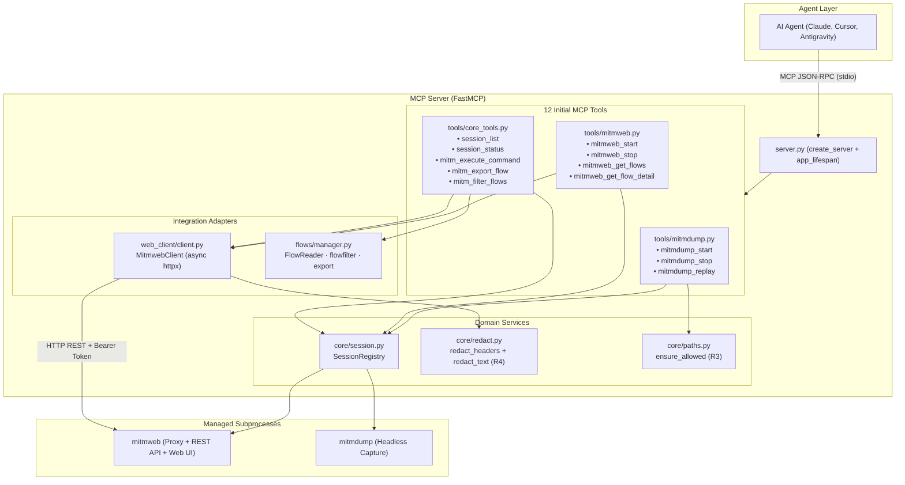
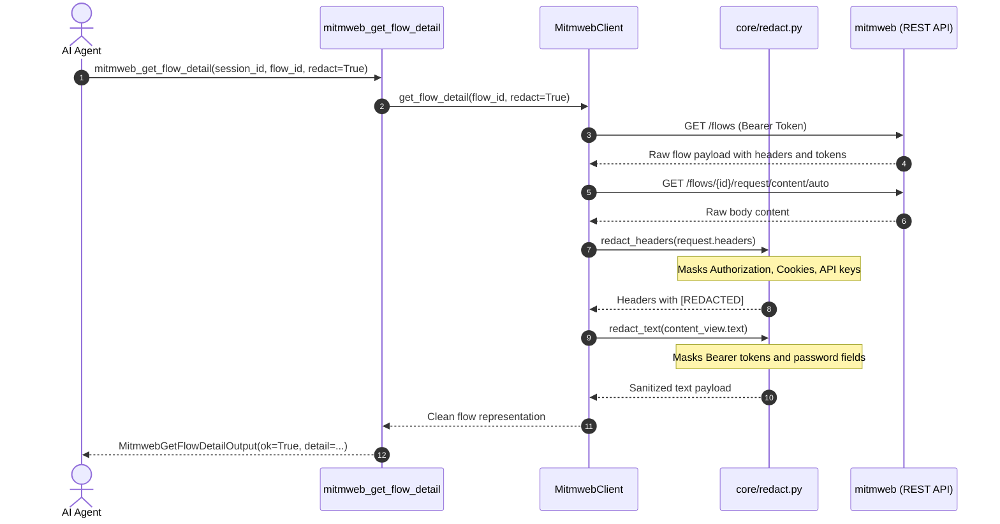
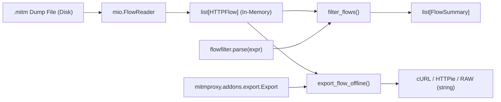

# Technical Specification — Phase 3: MCP Tools, REST Client, Redaction, and Offline Flows

> **Software Architecture Document · Phase 3**
> Companion of [0001-arquitetura-e-contratos-mcp.md](./0001-arquitetura-e-contratos-mcp.md), [ADR-001](../adr/0001-stack-tecnologico-e-arquitetura-de-execucao.md), and [ADR-002](../adr/0002-redacao-de-segredos-e-gestao-de-fluxos-offline.md).
> Status: IMPLEMENTED AND VALIDATED (Unit and integration suites passing).

---

## 1. Delivery Overview

Phase 3 established the core operational surfaces of the `mcp-security-mitmproxy` server, enabling AI agents to control traffic capture, inspect flows in real time across the REST bridge, and process captured artifacts offline without long-running proxy processes.

---

## 2. Catalog of the 12 Initial MCP Tools

All tools operate under invariant **I1**: they return the typed [`ToolResult`](file:///home/daniel/Code/mcp-security-mitmproxy/src/mcp_security_mitmproxy/schemas/common.py) envelope and never bubble raw exceptions to the MCP host. Domain failures map to explicit `ErrorCode` values.

| Tool | Module | Purpose | Input Contract | Output Contract | Security Controls |
| :--- | :--- | :--- | :--- | :--- | :--- |
| `mitmdump_start` | `tools/mitmdump.py` | Spawns headless capture session with specified modes. | `MitmdumpStartInput` | `MitmdumpStartOutput` | R3 (Path allowlists for `save_path` and `scripts`) |
| `mitmdump_stop` | `tools/mitmdump.py` | Terminates process and releases assigned listening ports. | `StopInput` | `ToolResult` | Deterministic timeout teardown |
| `mitmdump_replay` | `tools/mitmdump.py` | Replays client (`-C`) or server (`-S`) traffic from dumps. | `MitmdumpReplayInput` | `MitmdumpStartOutput` | R3 (Allowlist validation on `.mitm` files) |
| `mitmweb_start` | `tools/mitmweb.py` | Starts proxy with Web interface and REST bridge active. | `MitmwebStartInput` | `MitmwebStartOutput` | R1 (`web_host` defaults to 127.0.0.1) & R2 (Generated token) |
| `mitmweb_stop` | `tools/mitmweb.py` | Terminates mitmweb session and closes proxy/web ports. | `StopInput` | `ToolResult` | Graceful shutdown with forced timeout fallback |
| `mitmweb_get_flows` | `tools/mitmweb.py` | Fetches paginated list of captured HTTP/WS/TCP/UDP flows. | `MitmwebGetFlowsInput` | `MitmwebGetFlowsOutput` | Active session validation and bounded pagination |
| `mitmweb_get_flow_detail` | `tools/mitmweb.py` | Inspects deep flow payload details with content viewing. | `MitmwebGetFlowDetailInput` | `MitmwebGetFlowDetailOutput` | R4 (Default secret redaction) |
| `session_list` | `tools/core_tools.py` | Lists all active and historical sessions in registry. | None (`Context`) | `SessionListOutput` | Reads isolated in-memory registry |
| `session_status` | `tools/core_tools.py` | Retrieves status, PID, ports, and metadata for a session. | `SessionStatusInput` | `SessionStatusOutput` | Session UUID validation |
| `mitm_execute_command` | `tools/core_tools.py` | Executes allowlisted internal commands on running mitmweb. | `MitmExecuteCommandInput` | `MitmExecuteCommandOutput` | R3 (Strict `ALLOWED_COMMANDS` enforcement) |
| `mitm_export_flow` | `tools/core_tools.py` | Exports flow to cURL, HTTPie, or RAW formats via dump or session. | `MitmExportFlowInput` | `MitmExportFlowOutput` | R3 (Allowlist verification) and in-process export |
| `mitm_filter_flows` | `tools/core_tools.py` | Evaluates FlowFilter syntax (`~u`, `~m`, `~c`, etc.) on dump or session. | `MitmFilterFlowsInput` | `MitmFilterFlowsOutput` | In-process syntax check via `flowfilter.parse` |

---

## 3. REST Client Adapter (`web_client/client.py`)

The [`MitmwebClient`](file:///home/daniel/Code/mcp-security-mitmproxy/src/mcp_security_mitmproxy/web_client/client.py) class acts as the asynchronous HTTP bridge between the MCP server and running `mitmweb` instances:

1. **Authentication**: The MCP server generates a cryptographic token via `secrets.token_hex(16)` when spawning mitmweb. The client injects `Authorization: Bearer <token>` into all outgoing HTTP requests.
2. **Client Lifecycle**: Supports asynchronous context management (`async with MitmwebClient(...) as client:`) ensuring immediate cleanup of underlying TCP sockets via `httpx.AsyncClient`.
3. **Flow Mapping**: `get_flows` slices items in memory according to `offset` and `limit`, transforming raw proxy dictionaries into typed [`FlowSummary`](file:///home/daniel/Code/mcp-security-mitmproxy/src/mcp_security_mitmproxy/schemas/mitmweb.py) models.
4. **Exception Translation**: Maps `httpx` exceptions into domain errors:
   - `httpx.TimeoutException` ➔ `TimeoutError_` (`code: TIMEOUT`).
   - `httpx.RequestError` or HTTP 403 ➔ `UpstreamUnreachableError` (`code: UPSTREAM_UNREACHABLE`).

---

## 4. Secret Redaction Mechanism (`core/redact.py`)

To fulfill requirement **R4**, [`core/redact.py`](file:///home/daniel/Code/mcp-security-mitmproxy/src/mcp_security_mitmproxy/core/redact.py) applies non-destructive sanitization at the presentation boundary:

### Applied Sanitization Rules

1. **Sensitive Headers (`redact_headers`)**:
   - Explicit sensitive header names: `authorization`, `proxy-authorization`, `cookie`, `set-cookie`, `x-api-key`, `api-key`, `x-auth-token`, `private-token`, `token`, `access_token`.
   - Comprehensive rule: Any header containing the substring `token` is sanitized to `"[REDACTED]"`.
2. **Text Patterns (`redact_text`)**:
   - Bearer pattern: `Bearer\s+([A-Za-z0-9\-._~+/]+=*)` ➔ `Bearer [REDACTED]`.
   - Key-value patterns: Keys such as `access_token`, `refresh_token`, `api_key`, `apiKey`, `password`, `secret`, and `client_secret` have values replaced with `"[REDACTED]"`.

---

## 5. Offline Flow Management (`flows/manager.py`)

To allow forensic inspection without an active proxy runtime, [`flows/manager.py`](file:///home/daniel/Code/mcp-security-mitmproxy/src/mcp_security_mitmproxy/flows/manager.py) performs in-process operations:

1. **Dump Parsing (`read_flows_from_dump`)**: Reads binary streams via `mitmproxy.io.FlowReader`, returning native `HTTPFlow` objects. The path is validated against allowlists (R3).
2. **Syntax Evaluation (`filter_flows`)**: Compiles expressions (`~u`, `~m`, `~c`, `~b`, `~h`, `~d`) with `mitmproxy.flowfilter.parse`. Syntax errors raise `InvalidInputError`.
3. **Offline Export (`export_flow_offline`)**: Initializes an in-memory `mitmproxy.master.Master` instance and attaches the `Export` addon to export flows to:
   - `curl`
   - `httpie`
   - `raw`
   - `raw_request`
   - `raw_response`

---

## 6. Governance and Security Safeguards

| Requirement | Addressed Threat | Concrete Implementation |
| :--- | :--- | :--- |
| **R1 — Restricted Network Bind** | Unintended interface exposure on local networks or Internet. | `DEFAULT_WEB_HOST = "127.0.0.1"`. Public binds (`0.0.0.0`) require explicit flags and trigger `binds_publicly`. |
| **R2 — CA & Credential Isolation** | Unauthorized process access to private keys or tokens. | 16-byte random authentication token (`secrets.token_hex(16)`), omitted from outputs. Isolated session dirs created with strict `0700` permissions. |
| **R3 — Strict Allowlists** | Directory traversal and remote code execution. | `ensure_allowed` resolves symlinks against configured roots (`allowed_dump_roots`, `allowed_script_roots`). `mitm_execute_command` enforces `ALLOWED_COMMANDS`. |
| **R4 — Automated Secret Redaction** | Credential leakage into LLM context windows. | Active by default (`redact=True`) on `mitmweb_get_flow_detail`, applying header replacement and heuristic body masking. |
| **R5 — Zero Implicit Escalation** | Execution of privileged actions without operator notice. | Modes requiring Linux elevated privileges (`local` with eBPF, `tun`) fail with clear configuration errors rather than running implicit `sudo`. |
