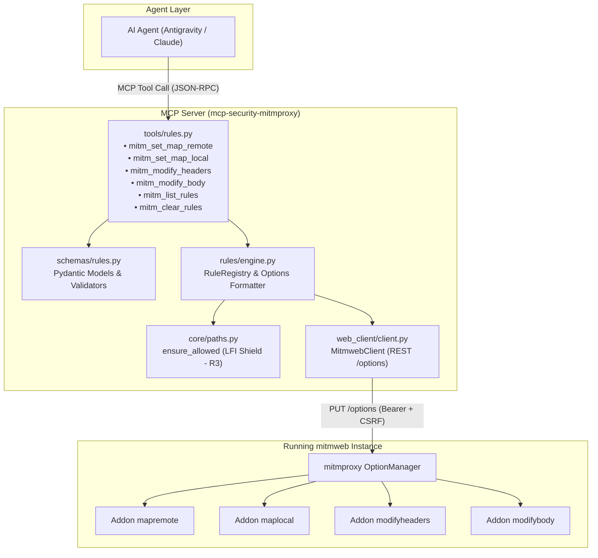
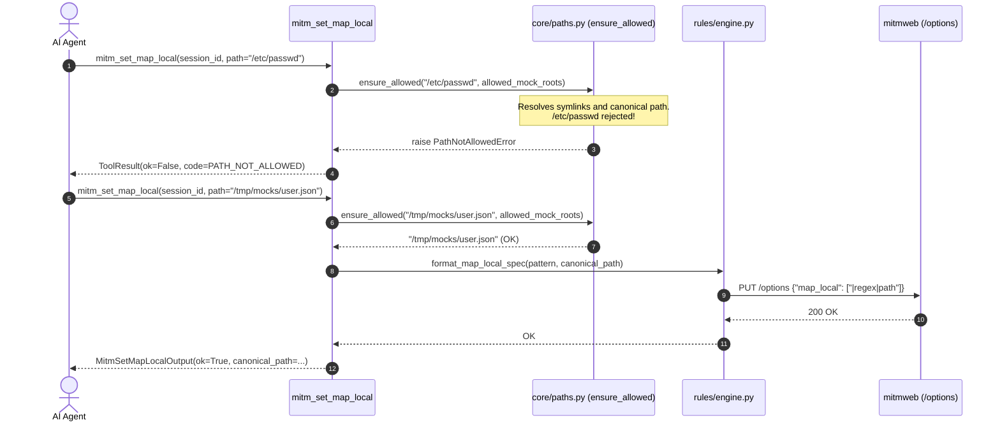

# Technical Specification — Phase 4: Codeless Traffic Manipulation and Addon System

> **Software Architecture Document · Phase 4**
> Companion of [0001-arquitetura-e-contratos-mcp.md](./0001-arquitetura-e-contratos-mcp.md), [0002-fase-3-ferramentas-mcp-webclient-redaction.md](./0002-fase-3-ferramentas-mcp-webclient-redaction.md), and [ADR-0003](../adr/0003-manipulacao-trafego-regras-addons.md).
> Status: IMPLEMENTED AND VALIDATED (Unit, live integration, and adversarial suites passing).

---

## 1. Context and Goals

In Phase 4, `mcp-security-mitmproxy` expanded beyond passive observability into **active runtime traffic mutation**. AI agents can inject mock responses, rewrite routes, inject/remove headers, and alter HTTP/WebSocket payloads without authoring custom Python scripts or restarting active proxy instances.

### 1.1 Operational Capabilities

1. **Map Remote (`map_remote`)**: Route redirection and URL rewriting evaluated against regex patterns and flow filters.
2. **Map Local (`map_local`)**: Response mocking serving static content from allowlisted local files.
3. **Header Modification (`modify_headers`)**: Dynamic injection, overwriting, or deletion of HTTP headers in requests and responses.
4. **Body Modification (`modify_body`)**: Regex or literal substitution within transmitted payloads.
5. **Governed Addon Loading**: Secure loading of auxiliary Python scripts in isolated directories with restricted permissions.

---

## 2. Architecture Diagram and Mutation Flow



---

## 3. Contract Models and Pydantic Schemas (`schemas/rules.py`)

Rules enforce strict Pydantic validation to prevent delimiter injection attacks in mitmproxy's internal spec syntax (`[/flow-filter]/pattern/replacement`).

### 3.1 Map Remote (`mitm_set_map_remote`)

Redirects incoming requests matching a URL regex to a replacement destination.

```python
class MapRemoteRuleSpec(BaseModel):
    filter_expression: str | None = Field(
        default=None,
        description="Optional mitmproxy flow filter (e.g., '~u api.example.com & ~m POST').",
    )
    url_pattern: str = Field(
        description="Regular expression matching the request URL to intercept.",
    )
    replacement_url: str = Field(
        description="Destination URL to forward the intercepted request to.",
    )

class MitmSetMapRemoteInput(BaseModel):
    session_id: str
    rule: MapRemoteRuleSpec

class MitmSetMapRemoteOutput(ToolResult):
    rule_id: str | None = None
```

### 3.2 Map Local (`mitm_set_map_local`) — With Strict LFI Shielding

Serves the contents of a local file as a mocked HTTP response.

```python
class MapLocalRuleSpec(BaseModel):
    filter_expression: str | None = Field(
        default=None,
        description="Optional mitmproxy flow filter.",
    )
    url_pattern: str = Field(
        description="Regular expression matching the request URL to mock.",
    )
    local_path: str = Field(
        description="Path to local mock file (must reside within allowed_mock_roots).",
    )

class MitmSetMapLocalInput(BaseModel):
    session_id: str
    rule: MapLocalRuleSpec

class MitmSetMapLocalOutput(ToolResult):
    rule_id: str | None = None
    canonical_path: str | None = None
```

### 3.3 Header Modification (`mitm_modify_headers`)

Adds, overwrites, or removes HTTP headers.

```python
class HeaderOperation(str, Enum):
    SET = "set"        # Overwrites or creates the header
    REMOVE = "remove"  # Deletes matching header without replacement

class ModifyHeaderRuleSpec(BaseModel):
    filter_expression: str | None = Field(
        default=None,
        description="Flow filter (e.g., '~s' for responses, '~q' for requests).",
    )
    header_name: str = Field(
        description="Literal HTTP header name (RFC 9110 token, not a regex).",
    )
    header_value: str | None = Field(
        default=None,
        description="Literal replacement value. Required for SET, must be None for REMOVE.",
    )
    operation: HeaderOperation = HeaderOperation.SET

    @model_validator(mode="after")
    def _validate_operation(self) -> "ModifyHeaderRuleSpec":
        if self.operation is HeaderOperation.REMOVE and self.header_value is not None:
            raise ValueError("header_value must be omitted when operation=REMOVE")
        if self.operation is HeaderOperation.SET and self.header_value is None:
            raise ValueError("header_value is required when operation=SET")
        return self
```

Values starting with `@` are rejected at the schema level:

```python
    @field_validator("header_name")
    @classmethod
    def _check_header_name(cls, value: str) -> str:
        if not _HEADER_NAME_RE.fullmatch(value):
            raise ValueError("invalid header_name (RFC 9110 token required)")
        return value

    @field_validator("header_value")
    @classmethod
    def _reject_file_syntax(cls, value: str | None) -> str | None:
        if value is not None and value.startswith("@"):
            raise ValueError("header_value cannot start with '@'")
        return value

class MitmModifyHeadersInput(BaseModel):
    session_id: str
    rule: ModifyHeaderRuleSpec

class MitmModifyHeadersOutput(ToolResult):
    rule_id: str | None = None
    rendered_spec: str | None = None
```

### 3.4 Body Modification (`mitm_modify_body`)

Replaces request or response payload fragments using regular expressions.

```python
class ModifyBodyRuleSpec(BaseModel):
    filter_expression: str | None = Field(
        default=None,
        description="Flow filter (e.g., '~q & ~t json' for JSON requests).",
    )
    pattern: str = Field(
        description="Regex pattern identifying the body fragment to replace.",
    )
    replacement: str = Field(
        description="Replacement string (can be empty to remove matches).",
    )

    @field_validator("pattern")
    @classmethod
    def _check_pattern(cls, value: str) -> str:
        re.compile(value)  # Rejects invalid regex syntax at input boundary
        return value

    @field_validator("replacement")
    @classmethod
    def _reject_file_syntax(cls, value: str) -> str:
        if value.startswith("@"):
            raise ValueError("replacement cannot start with '@'")
        return value

class MitmModifyBodyInput(BaseModel):
    session_id: str
    rule: ModifyBodyRuleSpec

class MitmModifyBodyOutput(ToolResult):
    rule_id: str | None = None
    rendered_spec: str | None = None
```

### 3.5 Rule Inspection and Clearing

```python
class RuleEntry(BaseModel):
    rule_type: RuleType
    index: int = Field(ge=0, description="Position in option sequence (order = evaluation precedence).")
    raw_spec: str
    valid: bool = True

class MitmListRulesInput(BaseModel):
    session_id: str

class MitmListRulesOutput(ToolResult):
    rules: list[RuleEntry] = Field(default_factory=list)
    counts: dict[str, int] = Field(default_factory=dict)

class MitmClearRulesInput(BaseModel):
    session_id: str
    rule_type: RuleType | None = Field(
        default=None,
        description="Target rule type to clear. None clears all four rule families.",
    )

class MitmClearRulesOutput(ToolResult):
    cleared_count: int = 0
    remaining: dict[str, int] = Field(default_factory=dict)
```

---

## 4. Security Governance and Safeguards (R1 through R5)

Dynamic traffic manipulation exposes new attack surfaces that require explicit defenses:



1. **Local File Inclusion Prevention (LFI - R3)**:
   - Mitmproxy's `map_local` reads any host file accessible to the process UID.
   - **Mandatory Control**: Every path supplied to `mitm_set_map_local` must pass through `ensure_allowed()` against `settings.allowed_mock_roots`. Directory traversal sequences, escaping symlinks, `/etc/shadow`, `~/.ssh`, or any path outside configured roots trigger `PATH_NOT_ALLOWED`. An empty allowlist denies all mocking operations by default.
2. **Delimiter Collision Shielding**:
   - Native spec syntax is `[/flow-filter]/subject/replacement` (`utils/spec.py`), where the separator is the **first character**. If that character appears in the pattern or replacement, mitmproxy misparses the spec.
   - `rules/engine.py` dynamically chooses a delimiter (`|`, `#`, `!`, `;`) not present in any component of the rule, verified by round-trip parsing tests.
3. **Blocking `@filepath` Syntax in Headers and Bodies**:
   - Mitmproxy treats leading `@` as an instruction to read file contents from disk.
   - Schema validators explicitly reject any `header_value` or `replacement` starting with `@`.
4. **Reserved Option Protection**:
   - `RESERVED_SET_OPTIONS` includes `confdir`, `scripts`, `map_local`, `map_remote`, `modify_headers`, `modify_body`, `save_stream_file`, and `hardump`.
   - Raw attempts to mutate these options via `--set` trigger `INVALID_INPUT`. Only `rules/engine.py` generates these options after path validation.
5. **Python Addon Script Isolation**:
   - Script loading remains restricted to `allowed_script_roots` with strict path validation.

---

## 5. Implementation Strategy and REST Interaction

### 5.1 Dynamic Updates via REST API

In active `mitmweb` sessions, `MitmwebClient` updates rules through REST options endpoints:

- Read active rules: `GET /options` (`map_remote`, `map_local`, `modify_headers`, `modify_body`).
- Mutate rules: **`PUT /options`** with the complete updated sequence. Mutating a `Sequence[str]` option overwrites the list; every update executes as a read-modify-write operation.

### 5.2 Headless `mitmdump` Startup Support

For headless sessions started with `mitmdump_start`, initial rules are formatted by `rules/engine.py` and passed as individual `--set` flags:

```bash
mitmdump --set map_remote="/~m POST|^https://api\.example\.com/|https://staging.internal/" \
         --set map_local="|/api/v1/mock|/srv/mocks/user.json"
```
