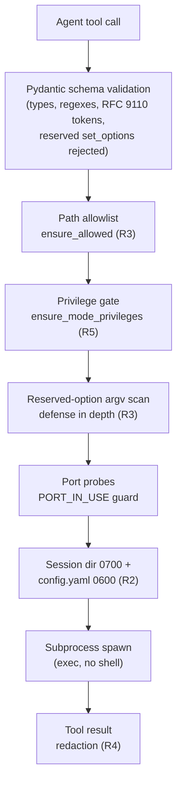

# Security Model

The server wraps a traffic-interception tool and hands its controls to an LLM agent. The design assumes the agent will sometimes be wrong, confused or prompt-injected, and makes the dangerous paths fail closed. Five requirements (R1–R5) define the boundaries; every one of them is enforced in code, at a specific layer, with a specific error code.

## R1 — Restricted network binding

**Rule:** the mitmweb REST/Web UI surface binds to loopback by default. Exposing it beyond the machine is an explicit choice, never a fallback.

**Enforcement:** `Settings.web_host` and `mitmweb_start.web_host` default to `127.0.0.1`. The `binds_publicly` property flags any non-loopback setting (`127.0.0.1`, `::1`, `localhost` are the loopback set). REST calls authenticate with a bearer token generated per session.

**Operator guidance:** leave the default. If you must bind non-loopback, put the surface behind a network control you own, and treat the bearer token as the only remaining barrier.

## R2 — Key isolation and session protection

**Rule:** authentication secrets never appear on process command lines or in tool outputs; session state lives in per-session directories readable only by the owning user.

**Enforcement:**

* The web token is generated with `secrets.token_hex(16)` unless the caller supplies `web_password`.
* It is written to `<session_dir>/config.yaml` with `0600` permissions and delivered to mitmproxy via `confdir` — never through `--set web_password=...`, which would be visible in `/proc/<pid>/cmdline`.
* The token is held in the registry's memory and used internally by the REST bridge. `mitmweb_start` never echoes it back.
* Session directories are `0700`; CA material stays inside the session's `ca/` directory.

## R3 — Strict allowlists for paths and commands

**Rule:** the agent can only touch files and commands the operator has allowlisted, and can only mutate traffic through validated tools — never through raw escape hatches.

**Enforcement, layer by layer:**

1. **Path allowlist** — `core.paths.ensure_allowed` expands and resolves the requested path to its canonical form (symlinks included), then requires it to be inside one of the configured roots (`allowed_dump_roots`, `allowed_script_roots`, `allowed_mock_roots`). An empty root list rejects everything. Failures raise `PATH_NOT_ALLOWED` with the canonical path and the roots in `detail`.
2. **Command allowlist** — `mitm_execute_command` accepts exactly: `view.clear`, `view.properties.set`, `flow.kill`, `flow.resume`, `flow.mark`, `flow.comment`, `replay.client`, `replay.server`. Anything else → `COMMAND_NOT_ALLOWED`, with the allowed set in `detail`.
3. **Reserved `--set` options** — raw option overrides cannot touch the options that would defeat the layers above. Two independent guards reject them: a schema validator on every tool input and a final argv scan in the registry before spawn (defense in depth).

### Reserved options and why each is blocked

| Option | What an attacker would do with it |
| :--- | :--- |
| `confdir` | Point mitmproxy at another config directory, defeating session isolation and secret delivery. |
| `scripts` | Load a Python addon from an arbitrary path — direct code execution, bypasses the script allowlist. |
| `map_local` | Serve any file on the host to proxy clients (local file inclusion). Must go through `mitm_set_map_local` → `ensure_allowed`. |
| `map_remote` | Assemble routing rules from raw strings instead of the validated compiler. |
| `modify_headers` | Use the `@path` replacement syntax to disclose a host file; must go through the header tool. |
| `modify_body` | Same `@path` disclosure channel; must go through the body tool. |
| `save_stream_file` | strftime-expanded arbitrary write path. |
| `hardump` | HAR export to an arbitrary path — arbitrary write. |

The rule tools are the only writers of the four traffic-mutation options, and they validate paths first.

## R4 — Automatic secret redaction

**Rule:** anything a tool returns to the agent passes through redaction first. Inspection may be read-only; credential disclosure is not a side effect of reading traffic.

**Enforcement:** `mitmweb_get_flow_detail` redacts by default (`redact: true`); `mitm_export_flow` always redacts with no opt-out; flow summaries never carry bodies. The engine and its coverage are documented in [Secrets Handling](05-secrets-handling.md).

## R5 — No implicit privilege escalation

**Rule:** modes that need elevated kernel capabilities are refused at the tool boundary; the server never tries to escalate.

**Enforcement:** `ensure_mode_privileges` rejects `local` (needs `CAP_NET_ADMIN`/eBPF on Linux) and `tun` (needs a TUN interface) with `INVALID_INPUT` before any argv is built. The registry repeats the check pre-spawn, so no caller can bypass it. If you need these modes, run mitmproxy in an environment that already holds the capabilities — outside this server.

## Request pipeline

Where the checks sit between an agent request and a running child process:

Every arrow that can fail produces a typed `ToolError`; nothing raises past the tool boundary.

## Handling restriction errors

The envelope is uniform: `ok: false` plus `error.code`, `error.message`, `error.detail`. Respond to the code, not the prose.

| Code | Meaning | How to proceed |
| :--- | :--- | :--- |
| `INVALID_INPUT` | Schema violation, reserved option, privileged mode, bad regex, missing replay file. | Read `message`/`detail`. For reserved options, use the dedicated rules tools instead of `set_options`. For privileged modes, there is no workaround inside this server. |
| `PATH_NOT_ALLOWED` | Canonical path outside the allowlist, or no roots configured. | Either use a path under a configured root, or extend the matching root list in `Settings` and restart the server ([Configuration](03-configuration.md)). Check `detail.path` — it shows the *resolved* path, which often reveals a symlink or `..` you did not intend. |
| `COMMAND_NOT_ALLOWED` | Command outside the fixed allowlist. | Pick from `detail.allowed`. The list is code, not configuration — extend it in `tools/core_tools.py` if you maintain a fork, never at runtime. |
| `SESSION_NOT_FOUND` | Unknown `session_id`. | Call `session_list` to see live ids. Sessions do not survive a server restart. |
| `SESSION_NOT_RUNNING` | Session exists but is `starting`/`stopping`/`stopped`/`failed`, or has no mitmweb bridge. | Check `session_status`. Rules and inspection tools need a running `mitmweb` session — restart with `mitmweb_start` if needed. |
| `PORT_IN_USE` | Requested port taken (by another session or another process). | Choose another port. Proxy ports probe against `listen_host`, the web port against `web_host`. |
| `PROCESS_SPAWN_FAILED` | The executable could not start (missing binary, bad argv). | Verify `mitmdump`/`mitmweb` are on `PATH` inside the server's environment. |
| `UPSTREAM_UNREACHABLE` | The mitmweb REST bridge did not answer (connection refused, 403, unexpected status). | Confirm the session is running and the web token still matches (do not restart mitmweb manually). A 403 usually means the bridge lost authentication — restart the session. |
| `TIMEOUT` | The child survived `SIGINT`/`SIGTERM` within `timeout_seconds`. | Retry the stop with `force: true` to escalate to `SIGKILL`. |
| `INTERNAL_ERROR` | Unexpected exception. `message` carries only the exception class name — never its arguments (those can contain secrets). | Reproduce, then inspect server-side logs. |

Two habits prevent most restriction friction:

* **Configure roots up front.** The default allowlists are empty, so the first `save_path`/`scripts`/`map_local` use always fails. Decide the roots before the session starts ([Configuration](03-configuration.md#configuring-the-allowlists-the-restriction-knobs)).
* **Prefer the dedicated tools over raw options.** Every dangerous mitmproxy capability that the rules tools cover is *blocked* in `set_options`. Going through `mitm_set_map_local`, `mitm_modify_headers` and `mitm_modify_body` is not just allowed — it is the only path.
